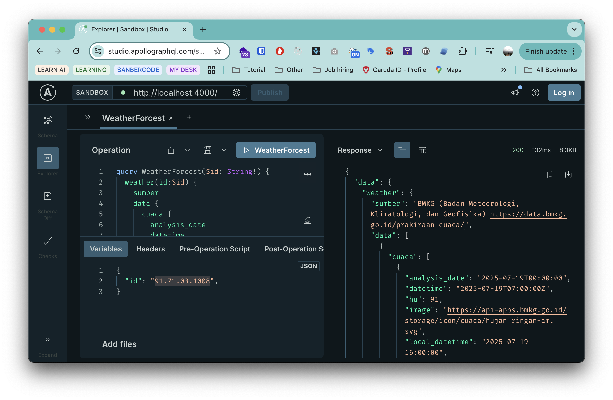

<h1 align="center">WEATHER-API GRAPHQL 🌧️</h1>
<p align="center">


</p>
<p align="center">
Unofficial Weather API Wrapper Easy to use in Graphql. Reference from API BMKG (Badan Meteorologi, Klimatologi, dan Geofisika) <a href="https://data.bmkg.go.id/prakiraan-cuaca/" target="_blank">https://data.bmkg.go.id</a>
</p>
<p>

</p>

## Basic Request

```bash

```

## Link

- available in Graphql ✴️. If you want to try it, please visit [https://studio.apollographql.com/sandbox/explorer](https://studio.apollographql.com/sandbox/explorer) and then enter the url `https://weather-api.pace11.my.id`
