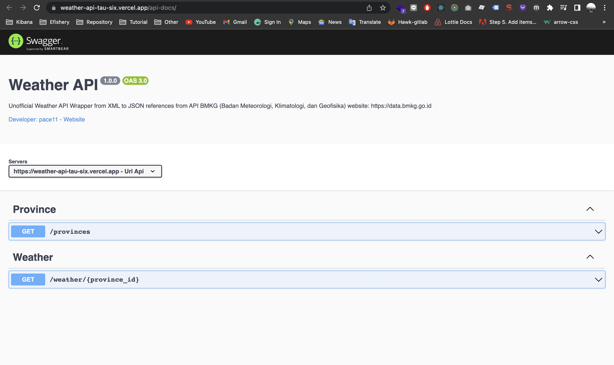

## WEATHER-API 🌧️

Unofficial Weather API Wrapper Easy to use in JSON Format. Reference from API BMKG (Badan Meteorologi, Klimatologi, dan Geofisika) [https://data.bmkg.go.id](https://data.bmkg.go.id)

### Stack

- NodeJS, ExpressJS ✅
- Xml JS ✅
- Swagger UI ✅
- Apollo Graphql ✅

### Link

- [Weather API URL](https://weather-api-tau-six.vercel.app/)
- [Docs Swagger](https://weather-api-tau-six.vercel.app/api-docs/)
- available in Graphql Version 🆕✴️. If you want to try it, please visit [https://studio.apollographql.com/sandbox/explorer](https://studio.apollographql.com/sandbox/explorer) and then enter the url `https://weather-api-tau-six.vercel.app/graphql`

